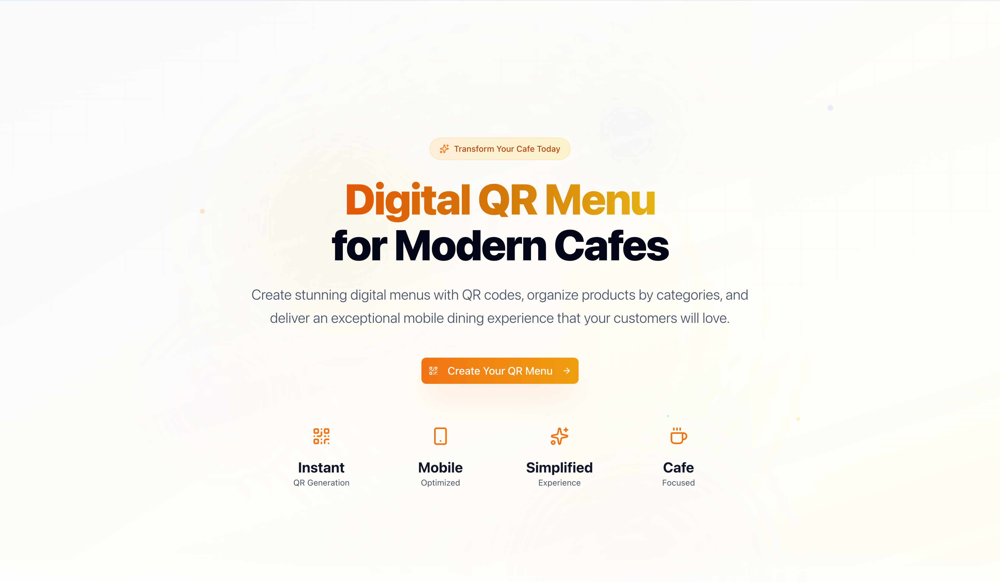

# QR Cafe

Manageable, multi-use QR Menu SaaS platform for cafes & restaurants.



## Prerequisites

Before you begin, ensure you have the following installed:

- **Node.js 18+**: Runtime environment
- **Supabase Account**: For database and authentication
- **Cloudflare Turnstile Account** (optional): For CAPTCHA functionality

## Installation

### 1. Clone the Repository

```bash
git clone <repository-url>
cd qr-cafe
```

### 2. Install Dependencies

```bash
npm install
```

This will install all required dependencies including Next.js, Supabase client, UI libraries, and development tools.

### 3. Environment Configuration

Copy the example environment file and configure your settings:

```bash
cp env.example .env.local
```

Edit `.env.local` with your configuration. The application supports multiple environments (development, staging, production). See the [Environment Variables Documentation](./docs/environment-variables.md) for detailed setup instructions.

### 4. Supabase Setup

#### Create a Supabase Project
1. Go to [supabase.com](https://supabase.com) and create a new account
2. Create a new project
3. Wait for the project to be fully initialized

#### Database Configuration
1. Navigate to your Supabase project dashboard
2. Go to the SQL Editor
3. Run the migration files from the `supabase/migrations` directory in order
4. Alternatively, use the Supabase CLI to apply migrations:

```bash
# Install Supabase CLI if not already installed
npm install -g supabase

# Link your project
supabase link --project-ref your-project-ref

# Apply migrations
supabase db push
```

#### Authentication Setup
1. In your Supabase dashboard, go to Authentication > Settings
2. Configure your site URL and redirect URLs
3. Set up authentication providers if needed
4. Configure email templates if using email authentication

#### Storage Setup
1. Go to Storage in your Supabase dashboard
2. Create a bucket for menu images
3. Configure bucket policies for public access to images
4. Set up CORS policies if needed

## Development

### Start Development Server

```bash
npm run dev
```

The application will be available at `http://localhost:3000`.

### Code Quality

The project uses Biome for fast linting and formatting:

```bash
# Check for issues
npm run lint

# Auto-fix issues and format code
npm run format
```

## Database Schema

The application uses PostgreSQL with the following main tables:

- **users**: User accounts and profiles
- **cafes**: Cafe/business information
- **categories**: Menu categories
- **products**: Menu items
- **menu_stats**: Analytics and usage statistics

All migrations are located in the `supabase/migrations` directory and should be applied in order.

## Deployment

### Build for Production

```bash
npm run build
```

### Environment Variables for Production

Ensure all production environment variables are set:

- `NEXT_PUBLIC_ENV=production`
- `NEXT_PUBLIC_BASE_URL_PROD=https://yourdomain.com`
- Production Supabase credentials
- Any other production-specific variables

### Deployment Platforms

The application can be deployed to:

- **Vercel**: Recommended for Next.js applications
- **Netlify**: Alternative hosting platform
- **Self-hosted**: Using Docker or traditional hosting

### Database Deployment

For production database setup:

1. Create a production Supabase project
2. Apply all migrations from `supabase/migrations`
3. Configure production environment variables
4. Set up database backups and monitoring

### Database Changes

When making database changes:

1. Create a new migration file using the provided script
2. Test migrations on a development database first
3. Update any affected TypeScript types
4. Document schema changes in the migration file

## License

This project is licensed under the MIT License. See the LICENSE file for details.

